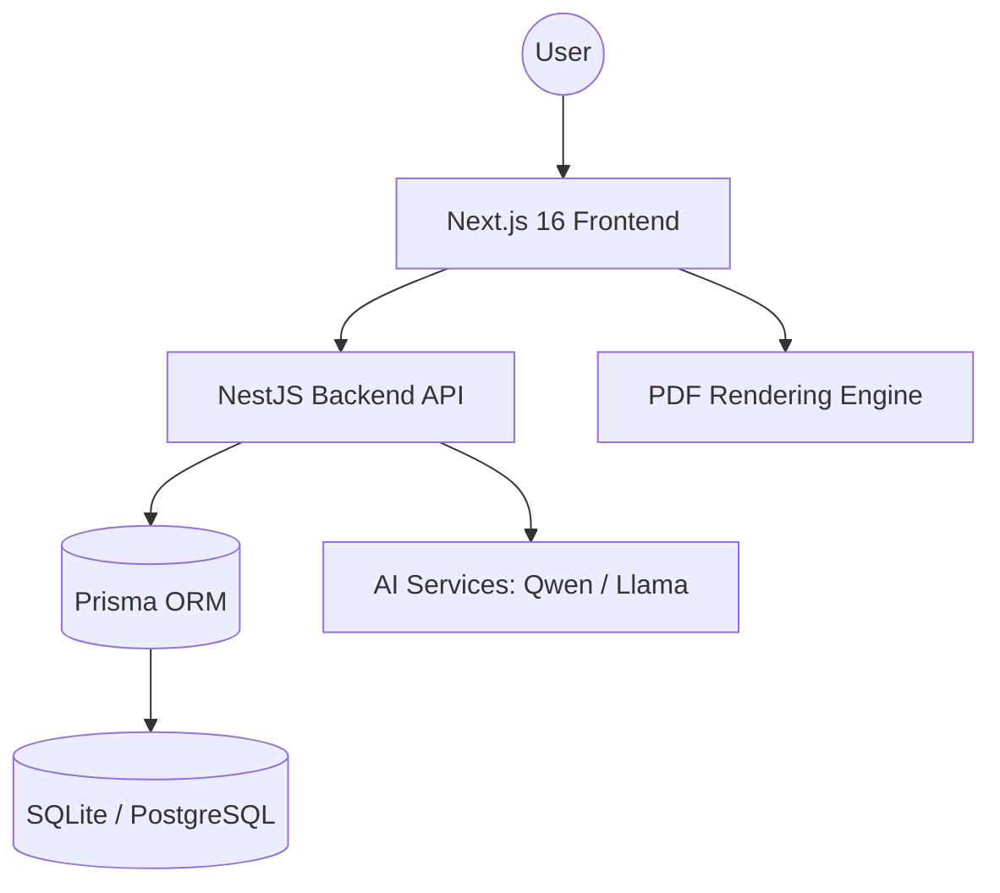

# CareerFlow - Easy-to-Use Job Search & Branding Tool

> **Smart Tools to Build Your Resume and Find the Right Job**

CareerFlow is a professional platform that helps you build a great resume and find jobs that match your skills using simple, clear AI help.

---

## 🚀 Quick Start Guide

CareerFlow is ready to run quickly so you can see how it works right away.

### 1. Simple Setup
```bash
# Enter the folder
cd careerflow

# Set up the website
npm install

# Set up the background system
cd backend
npm install
```

### 2. Prepare the Database
```bash
npx prisma db push
npm run seed
```
*This sets up a simple database with example info.*

### 3. Run the App
**Terminal 1 (System):**
```bash
npm run start:dev
```
**Terminal 2 (Website):**
```bash
npm run dev
```

### 4. Try It Out
- **Website**: [http://localhost:3000](http://localhost:3000)
- **Email**: `john.doe@example.com` / `password123`

---

## 🛠️ Main Features

### 1. Professional Resume Builder
A simple tool to create a perfect resume PDF.
- **Technology**: Built with modern web tools for high quality.
- **Goal**: A clean layout that helps your professional profile stand out.

### 2. Job Matcher
Find the best jobs for you by comparing your skills to real job listings.
- **Sources**: Uses real data from major job boards.
- **Simple Logic**: Shows you how well you fit a job in plain English.

### 3. Career Dashboard
One place to track all your job applications and skills.
- **Features**: A list of jobs you've applied for and tips on what skills to learn next.

### 4. Practice Interviews
A safe place to practice for your next interview and get feedback.
- **Simulation**: Get real-time help on your answers.
- **Interviewer**: Practice speaking and answering common questions.

---

## 🎨 Technical Stack & Architecture



### Key Technologies:
- **Frontend**: Next.js 16 (App Router), Tailwind CSS, Framer Motion, Zustand.
- **Backend**: NestJS, Swagger, JWT Auth.
- **Data**: Prisma ORM, SQLite.
- **AI**: Custom Neural prompt engineering for career advice and ATS scoring.

---

## 🏆 Unique Selling Points (USPs)
- **Premium Aesthetics**: Glassmorphic UI with micro-animations for an "Apple-like" feel.
- **Zero-Latency Feedback**: Real-time resume preview and simulation validation.
- **Independence**: Runs fully in Lite Mode with mock AI, but architected for scale with Docker and PostgreSQL.

---

## 📄 License & Team
Built with ❤️ by the **KodNest Team**. 
*Proprietary Engineering - All Rights Reserved.*
